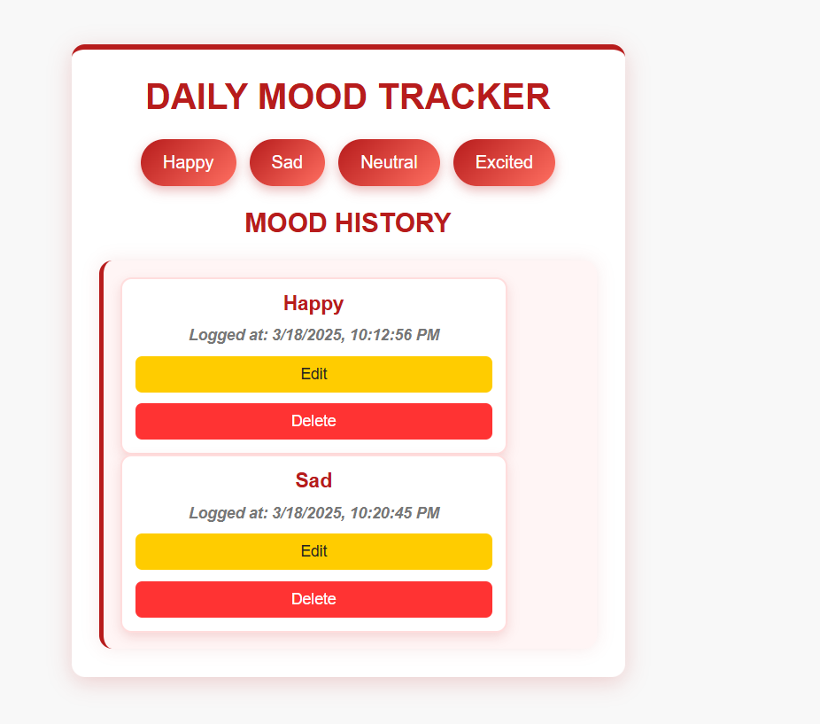

# Mood Tracker

A simple and interactive Mood Tracker application that allows users to log, edit, and delete their moods with timestamps. The moods are stored in **LocalStorage**, ensuring they persist even after a page refresh.

## 🚀 Features

- 📌 **Log Your Mood** - Click on a mood button to save your current mood.
- 🕒 **Timestamp Logging** - Each mood entry is saved with a date and time.
- ✏️ **Edit Entries** - Modify previously logged moods.
- ❌ **Delete Entries** - Remove mood entries when no longer needed.
- 💾 **Persistent Data** - Uses **LocalStorage** to retain moods even after refreshing.
- 🎨 **Elegant UI** - A red and white theme with modern styling.

## 📸 Screenshots
    

## 🌍 Live Demo
    link:   (https://mood-tracker-mauve-five.vercel.app/)

## 🛠️ Technologies Used

- HTML
- CSS (Red & White Theme)
- JavaScript (DOM Manipulation & LocalStorage)

## Repository URL
    link: (https://github.com/Rocky4512/mood-tracker)

---
Made with ❤️ by [Rohit Agrawal](https://github.com/Rocky4512)

